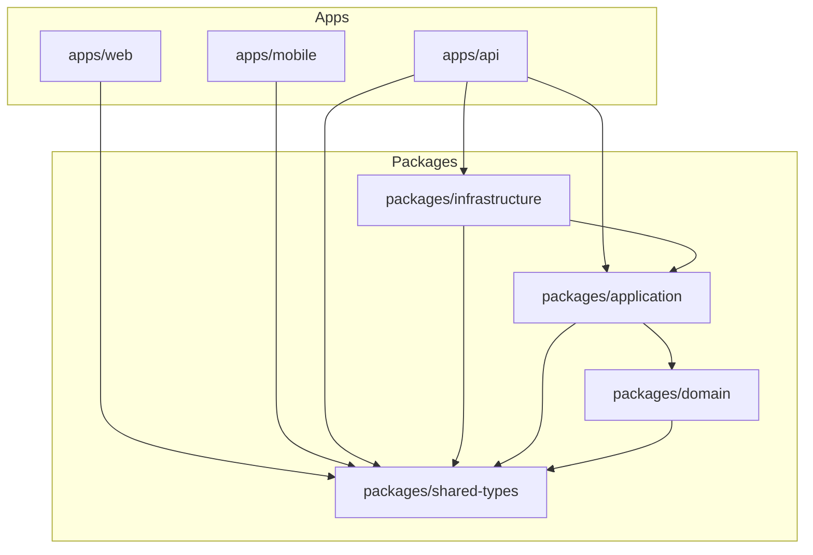

# Carbon Tracker

Monorepo workspace for carbon tracking application, designed with Clean Architecture and zero-tolerance code quality controls.

## Repository Structure

```
/apps
  /web          → React 19 + Vite + TypeScript (strict)
  /mobile       → React Native 0.74 + shared logic
  /api          → Express + TypeScript
/packages
  /domain       → Pure business logic (no frameworks)
  /application  → Use cases + ports
  /infrastructure → DB (Prisma), cache, external APIs
  /shared-types → Cross-package TypeScript types
/e2e            → Playwright end-to-end testing scaffold
```

## Architecture Diagram



## Architecture Decision Records (ADR)
- [ADR-001: Clean Architecture Pattern](docs/adr/adr-001.md)
- [ADR-002: TypeScript Strict Mode](docs/adr/adr-002.md)
- [ADR-003: Postgres over NoSQL](docs/adr/adr-003.md)
- [ADR-004: Monorepo Architecture](docs/adr/adr-004-monorepo.md)
- [ADR-005: Testing Strategy](docs/adr/adr-005-testing.md)
- [ADR-006: API Security Posture](docs/adr/adr-006-security.md)
- [ADR-007: Tailwind CSS + Radix UI](docs/adr/adr-007.md)
- [ADR-008: React Native with Expo](docs/adr/adr-008.md)
- [ADR-009: Gemini Integration](docs/adr/adr-009.md)

## Getting Started

### Prerequisites

- Node.js >= 20.x
- Docker and Docker Compose

### Setup Instructions

1. Clone the repository and navigate to the directory:
   ```bash
   cd carbon-tracker
   ```
2. Copy environment variables file:
   ```bash
   cp .env.example .env
   ```
3. Install dependencies:
   ```bash
   npm install
   ```
4. Start development database and support services:
   ```bash
   docker compose up -d
   ```

### Running Verification Tools

- **Linter**: Ensure zero lint violations across workspaces:
  ```bash
  npm run lint
  ```
- **Type Check**: Validate TypeScript compilation:
  ```bash
  npm run typecheck
  ```
- **Tests**: Execute Vitest (packages) and Jest (apps/web) suites with coverage:
  ```bash
  npm run test
  ```
- **Build**: Compile all packages and applications:
  ```bash
  npm run build
  ```

## Contribution Guide

1. Ensure Husky and lint-staged are active. They automatically run ESLint and typechecks on pre-commit.
2. Follow Dependency Inversion rules: never import `@carbon-tracker/domain` from `@carbon-tracker/infrastructure`. Use ports/interfaces defined in `@carbon-tracker/application`.
3. Do not introduce raw `any` types. Enforced by `@typescript-eslint/strict-type-checked`.
4. Keep functions concise. Limit functions to 25 lines maximum and cyclomatic complexity to 8 maximum.
